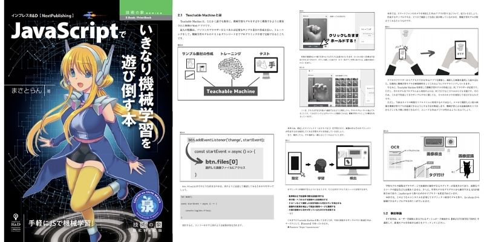

# JavaScriptでいきなり機械学習を遊び倒す本



## 本書について

本書は「機械学習って難しいんでしょ…？」と考えている人に向けて、誰でも手軽に機械学習を活用したWebアプリをJavaScriptで開発するための初心者向けチュートリアル本です。

難しい知識や言語を学習する必要はありません。基本的なJavaScriptしか使わないのでHTMLファイル1つあれば完成するのがポイントです。本書では特徴が違う3種類のWebサービスを組み合わせて、以下の3ステップで簡単に開発を進められます。

**①機械学習モデルをブラウザ上で構築**  
  ↓  
**②JavaScriptから制御**  
  ↓  
**③Webアプリの作成＆公開**  

　

■本書で楽しめるWebアプリ開発事例

- **Webカメラからリアルタイムにモノを認識する**
- **スマホで撮影した画像に何が見えるかを言い当てる**
- **写真を解析して指定したモノが写っていたらその場所を示す**
- **画像から有名人の顔、年齢、感情などを予測する**  
…など

　

これまで機械学習に興味はあるけど手が出せなかった人や、JavaScriptでユニークなWebアプリが作りたい人など、幅広い人に活用できる書籍になります。

★販売ページ：https://nextpublishing.jp/book/12404.html

（※Amazonなどのストアから **無料サンプル** もダウンロードできます）

　

### 目次詳細

```
はじめに
第1章 開発環境について
  1.1 Glitch
  1.2 Repl.it
  1.3 その他、オススメの開発環境サービス
第2章 初めての機械学習モデルを作る
  2.1 Teachable Machineとは
  2.2 モノを判別できるようにする
  2.3 トレーニング
  2.4 機械学習モデルのテスト
  2.5 補足
第3章 JavaScriptと連携してみよう
  3.1 機械学習モデルの作成
  3.2 プログラムから機械学習モデルを使うための準備
  3.3 基本的なプログラミング手法
  3.4 JavaScriptで機械学習モデルを制御する方法
  3.5 JavaScriptを利用した認識・予測処理
  3.6 手のカタチに合わせてCanvasの図形を動かしてみよう
第4章 スマホと連携してみよう
  4.1 プログラムの準備
  4.2 スマホで撮影した画像を読み込む
  4.3 機械学習モデルをプログラムに組み込む
  4.4 Netlifyを利用して公開する
  4.5 補足
第5章 オブジェクト検出モデルを作る
  5.1 Nanonetsとは
  5.2 事前準備
  5.3 検出する対象物を設定する
  5.4 トレーニングとテスト
  5.5 プログラムの準備
  5.6 JavaScriptの準備
  5.7 JavaScriptで学習モデルを制御する
  5.8 オブジェクトの検出を描画する
  5.9 補足
第6章 学習済みモデルを使ってみよう
  6.1 Clarifaiとは
  6.2 学習済みモデルをテストしよう
  6.3 事前準備
  6.4 プログラムの準備
  6.5 JavaScriptの準備
  6.6 JavaScriptで学習済みモデルを制御する
  6.7 取得した結果を画面に表示する
  6.8 補足
```

## 著者
まさとらん（ [https://twitter.com/0310lan](https://twitter.com/0310lan) ）

　

本書籍に関して分からないことあれば[フォーム](https://forms.gle/1U9jhByWuWQkL6VQ8)から問い合わせできます。
