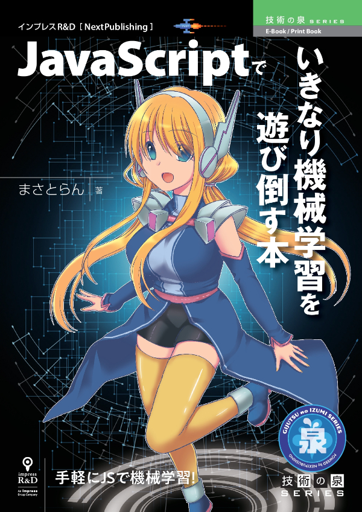

# JavaScriptでいきなり機械学習を遊び倒す本

## 本書について

本書は「機械学習って難しいんでしょ…？」と考えている人に向けて、誰でも手軽に機械学習を活用したWebアプリをJavaScriptで開発できるようになる初心者向けのチュートリアル本です。

基本的なJavaScriptの構文さえ使えれば、あとはマウス操作で簡単に機械学習モデルを構築できるWebサービスを組み合わせてミニWebアプリを開発する方法について丁寧に解説しています。これまで、興味はあるけど手が出せなかった人や機械学習を活用してみたいと考えている人、JavaScriptでWebアプリが作りたい人など、幅広く活用できる書籍となっています。

★販売ページ：https://nextpublishing.jp/book/12404.html

## サポートサイトについて

本書に掲載しているサンプルコードやダウンロードファイルなどをすべてまとめています。

ソースコードは独自プロジェクト、勉強会などなど…自由にご利用頂いて問題ありません。

