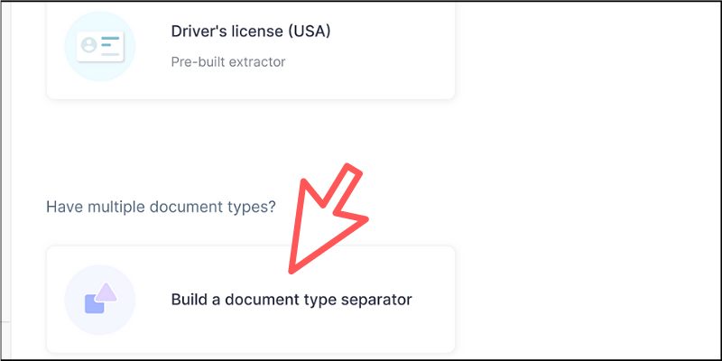
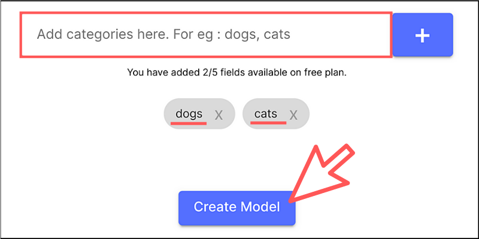
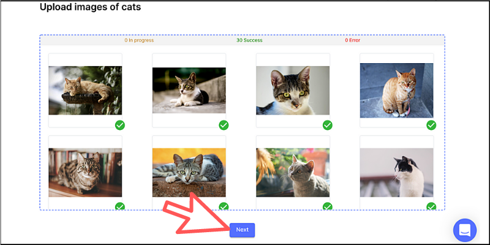
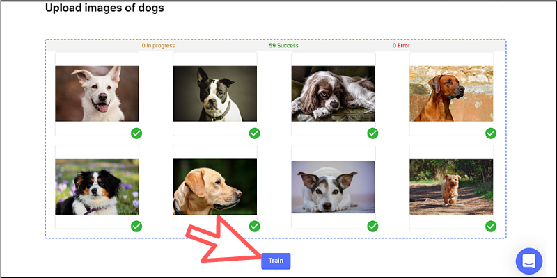
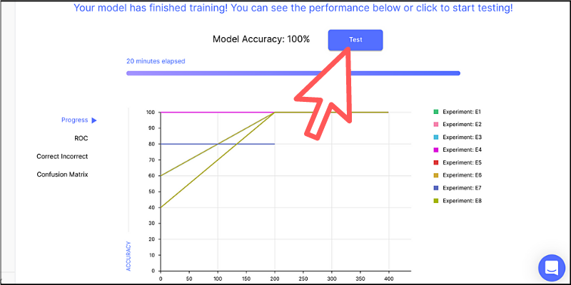
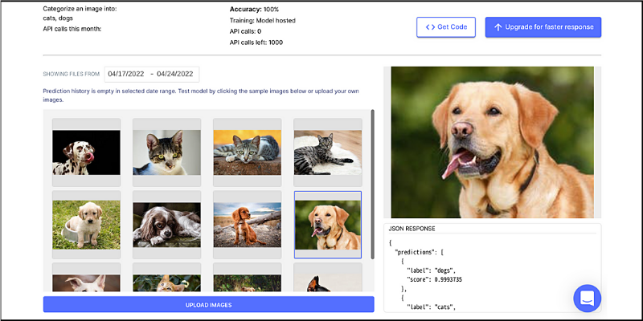
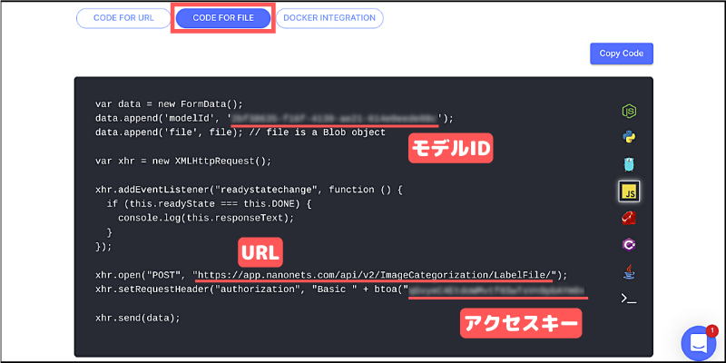
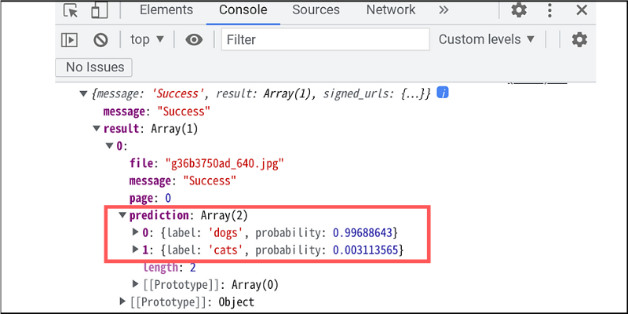

## 変更履歴（2022-4-24更新）

「Nanonets」がAIを使ったドキュメントのデータキャプチャサービスへと大きく方針転換したことにより、本書でご紹介している内容の通りに操作できなくなりました。

ただし、独自モデルを作成して画像を認識するプログラムを構築することは、現時点でも引き続き可能です。例えば、犬と猫の画像を認識できるモデルの作り方を以下に掲載しておきますので参考にしてください。

　

ログイン後のダッシュボード画面にて、以下のドキュメントタイプを選択してください。



（初回は「Other」から適当なプロジェクトを作成してから試してください）

　

次にカテゴリを作成します。ここでは「dogs」と「cats」という2つの文字列を入力して追加します。



　

画面上部に「Upload images of cats」と表示されているので、まずは猫の画像をドラッグ＆ドロップで追加します（最低25枚の猫画像が必要です）。



画像がなければ「[Pixabay](https://pixabay.com/ja/)」などのフリー素材を活用してみましょう。

アップロードが完了したら「Next」ボタンをクリックしてください。

　

今度は「Upload images of dogs」と表示されているので、犬の画像をドラッグ＆ドロップしましょう（猫の画像がすでに表示されていますが、そのまま犬の画像をアップロードできます）。



アップロードが完了したら「Train」ボタンをクリックしてください。すると、自動的に学習モデルが生成されていくのがわかります。

　
 
 しばらくすると学習結果が表示されるので、上部にある「Test」ボタンをクリックしてください。



　

この画面で学習モデルをテストできます。画像を切り替えてJSONのレスポンスが正しく表示されるかを確認しましょう（JSONデータの見方は本書を参考にしてください）。



　

「Get Code」ボタンをクリックすると、以下のようなソースコードが表示されます。



画面上部のタブを「CODE FOR FILE」に切り替えてから、「モデルID」「URL」「アクセスキー」をコピーしておいてください。

　

次に、本書でもご紹介している以下のプログラムを作ります（一部異なる部分もあるので以下のコードを参考にしてください）。

```html
<!DOCTYPE html>
<html>
<head>
  <meta charset="utf-8">
  <title>Nanonetsサンプルデモ</title>
</head>
<body>
  <div>
    <h1>Nanonetsサンプルデモ</h1>
    <input id="btn" type="file"/>
  </div>

  <script>
    const btn = document.getElementById('btn');

    const startEvent = () => {
      const url = '【URL】';  // URLを入力してください
      const key = window.btoa('【アクセスキー】');  // アクセスキーを入力してください

      const data = new FormData();

      data.append('modelId', '【モデルID】'); // モデルIDを入力してください
      data.append('file', btn.files[0]);

      fetch(url, {
        method: 'POST',
        body: data,
        headers: {'authorization': 'Basic ' + key}
      })
      .then(data => data.json())
      .then(json => console.log(json));
    }
    
    btn.addEventListener('change', startEvent);
  </script>
</body>
</html>
```

さきほどコピーしておいた「モデルID」「URL」「アクセスキー」をそれぞれ該当の箇所に挿入してください。

ブラウザから実行して、犬か猫の画像ファイルを選択すると学習モデルが認識した結果を以下のように出力してくれます。



この例では犬の画像ファイルを選んだので、「dogs」の認識率が高いことが分かります。

