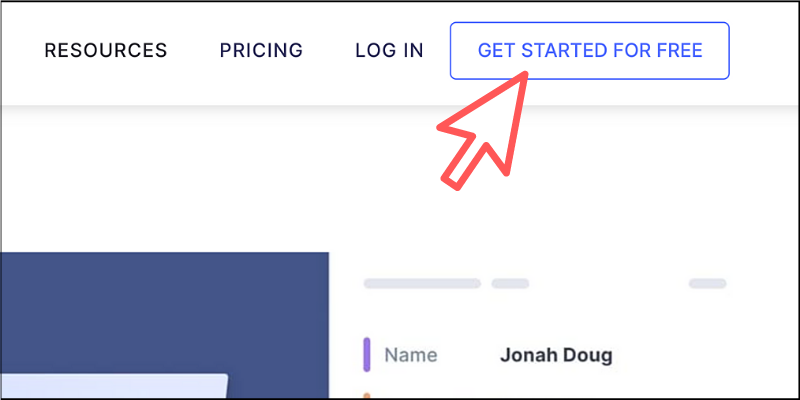

## Nanonetsのユーザー登録方法（2022-4-24更新）

まず最初に「Nanonets」のサイトにアクセスしましょう。

★https://nanonets.com/

　

画面上部にある以下のボタンをクリックして無料のユーザー登録を行います。

　

Googleアカウント、もしくはメールアドレスとパスワードを設定して登録します。

登録したアドレス宛に認証用のリンクが届くので、それをクリックすればユーザー登録は完了です。　

　

以下のようなダッシュボード画面が表示されるかを確認してください。

　

---

以下は旧版ですが、念のため残しておきます。

　

## Nanonetsのユーザー登録方法（旧版）

まず最初に「Nanonets」のサイトにアクセスしましょう。

★https://nanonets.com/

　

画面上部のボタンをクリックしてユーザー登録を行います。

　

ログイン画面が表示されたら、下部にある【Sign up】のリンクをクリックしてください。

　

Googleのアカウントを利用して登録するか、自分のメールアドレスを利用して登録する方法を選択しましょう。

登録したアドレス宛に認証用のリンクが届くので、それをクリックすればユーザー登録は完了です。　

　

以下のような画面が表示されることを確認してください。

