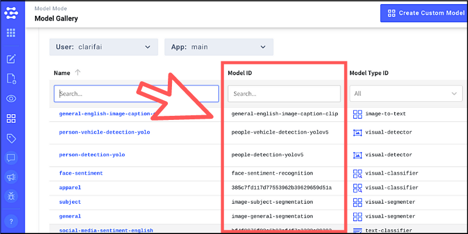

## 変更履歴（2022-4-24更新）

- [モデルギャラリーのURL変更](#モデルギャラリーのURL変更)
- [モデルIDの変更](#モデルIDの変更)
- [JavaScriptライブラリの変更](#JavaScriptライブラリの変更)

　

## モデルギャラリーのURL変更

本書でご紹介していた学習済みのモデルを閲覧できるページのURLが以下の通り変更になっています。

（旧URL）~~https://www.clarifai.com/model-gallery~~

（新URL）https://www.clarifai.com/developers/pre-trained-models

　

※旧URLでアクセスしても自動的に新URLにリダイレクトされます

　

## モデルIDの変更

仕様変更により、モデルIDが英数字の羅列ではなく意味のあるテキストキーワードになりました。

また、確認方法も変わりまして、まずはログインしてから新規プロジェクトを作成します。そして、詳細画面を表示して左メニューの「Model Mode」アイコンをクリックするとモデルIDが確認できます。

※例えば、一般的な「General Model」であれば「general-image-recognition」がモデルIDになります。

　

## JavaScriptライブラリの変更

更新中...
