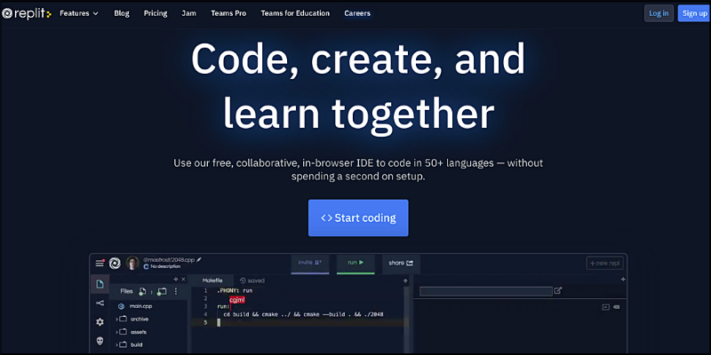
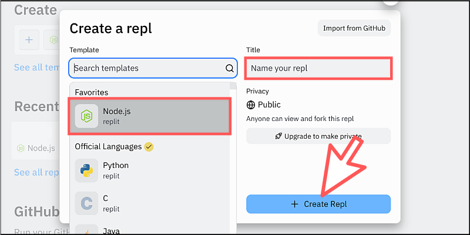
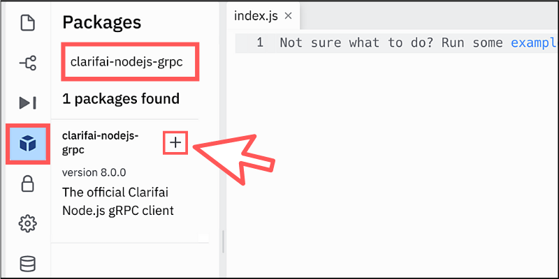
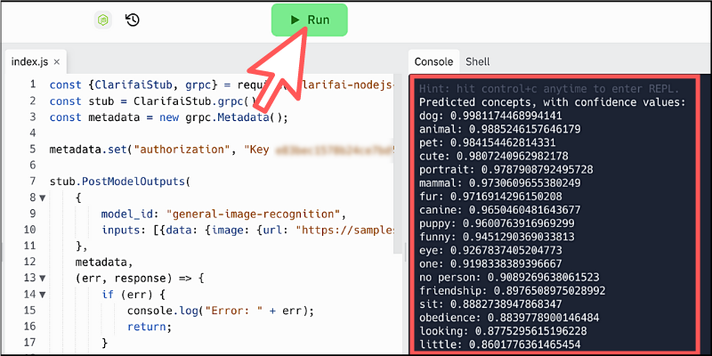
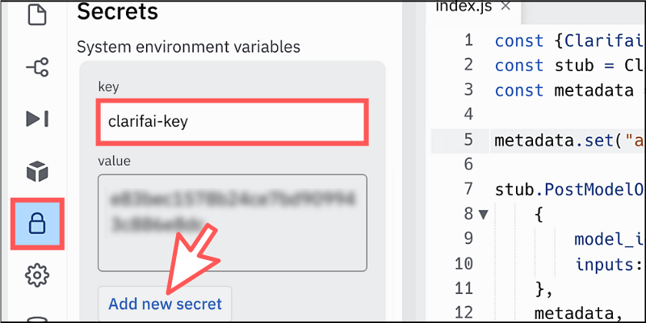

## 変更履歴（2022-4-24更新）

- [モデルギャラリーのURL変更](#モデルギャラリーのURL変更)
- [モデルIDの変更](#モデルIDの変更)
- [JavaScriptライブラリの変更](#JavaScriptライブラリの変更)

　

## モデルギャラリーのURL変更

本書でご紹介していた学習済みのモデルを閲覧できるページのURLが以下の通り変更になっています。

（旧URL）~~https://www.clarifai.com/model-gallery~~

（新URL）https://www.clarifai.com/developers/pre-trained-models

　

※旧URLでアクセスしても自動的に新URLにリダイレクトされます

　

## モデルIDの変更

仕様変更により、モデルIDが英数字の羅列ではなく意味のあるテキストキーワードになりました。

また、確認方法も変わりまして、まずはログインしてから新規プロジェクトを作成します。そして、詳細画面を表示して左メニューの「Model Mode」アイコンをクリックするとモデルIDが確認できます。


※例えば、一般的な「General Model」であれば「general-image-recognition」がモデルIDになります。

　

## JavaScriptライブラリの変更

本書でご紹介しているフロントエンドのJavaScriptライブラリが非推奨となったことから提供が中断されました。

そのため、引き続きJavaScriptで利用するにはNode.js向けのライブラリが必要になります。Node.jsの開発環境をお持ちの場合は、以下のコマンドからインストールができます。

```
npm install clarifai-nodejs-grpc
```

　
 
 Node.jsの開発環境をお持ちでない場合や、ちょっと試したいだけの場合には気軽にブラウザから使えるクラウドIDE「[Replit](https://replit.com/)」が便利です。

以下に、簡単なサンプルデモを試せるチュートリアルを掲載しておきますので参考にしてください。

　

まずは「Replit」にアクセスしてください。

★Replit：https://replit.com/



「Sign up」ボタンから無料のユーザー登録を済ませておきましょう。

　

ログインするとダッシュボード画面が表示されるので、新規プロジェクトを作成します。この際にTemplateの中から「Node.js」を選択します。



Titleに好きな名称を入力してから「+ Create Repl」ボタンをクリックします。

　

コードエディタが表示されるので、左側メニューから「Packages」を選択してClarifaiのライブラリ名「clarifai-nodejs-grpc」を入力します。



Packageが表示されたら「＋」アイコンをクリックするだけでインストールできます。

　

インストールが完了したら、「index.js」ファイルを開いて以下のコードをコピペしてください。

```js
const {ClarifaiStub, grpc} = require("clarifai-nodejs-grpc");
const stub = ClarifaiStub.grpc();
const metadata = new grpc.Metadata();

// ご自身のAPIキーを「Key 」のあとに差し替えてください
metadata.set("authorization", "Key **************");


stub.PostModelOutputs(
  {
    model_id: "general-image-recognition", // 利用したい学習モデルのIDを指定
    inputs: [{data: {image: {url: "https://samples.clarifai.com/dog2.jpeg"}}}] // AIに認識させたい画像ファイルのパスを指定（このサンプルは犬の写真です）
  },
  metadata,
  (err, response) => {
  
    // エラー処理
    if(err) {
      console.log(err);
      return;
    }

    // 何らかの理由でAPIが実行されなかったとき
    if(response.status.code !== 10000) {
      console.log(response.status.description);
      console.log(response.status.details);
      return;
    }

    // 正常にAPIが実行されたとき
    console.log("Predicted concepts, with confidence values:");
    for (const c of response.outputs[0].data.concepts) {
      console.log(c.name + ": " + c.value);
    }
  }
);
```

本書でご紹介している方法で「APIキー」を取得したら、コード内の指定箇所に挿入してください。例えば、APIキーが「123456789」ならば "Key 123456789" となります（※Keyのあとに半角スペースがあります）。

上記のコードは学習モデルに「General Model」を採用しているので、認識させたい画像ファイルが必要になります。上記のコードをそのまま使うと犬の写真を認識させた結果が以下のように表示されます。



コードエディタ上部の「Run」ボタンをクリックすると、プログラムが実行されて画面右側に結果が出力されます。

　

ちなみに、APIキーはそのままコードに入力すると危ないので環境変数に設定しておくと便利です。「Replit」の場合はコードエディタにある左側メニューの「Secrets」アイコンから設定できます。



「key」に好きな名称を入力して、「value」にAPIキーをコピペしたら下部のボタンをクリックして保存します。あとはプログラム内で`process.env['clarifai-key']`のように記述すればAPIキーを参照できるようになります。

つまり、コードにすると次のようになるわけです。

```
metadata.set("authorization", "Key " + process.env['clarifai-key']);
```

これで本人だけがAPIキーを確認できるようになります。
