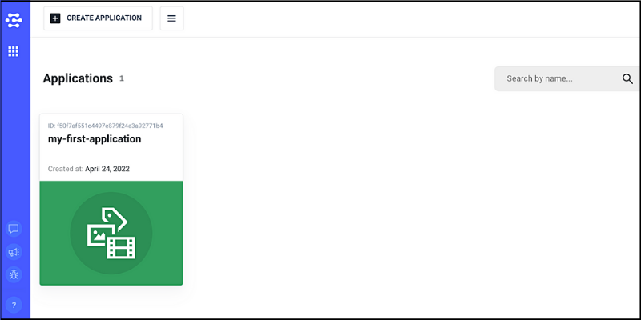
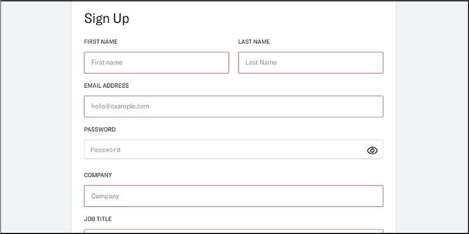
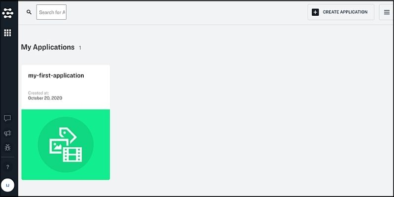

## Clarifaiのユーザー登録方法（2022-4-24更新）

まず最初に「Clarifai」のサイトにアクセスしましょう。

★https://www.clarifai.com/

　

画面上部のボタンをクリックしてユーザー登録を行います。

　

登録フォームが表示されるので、必要事項を入力していきましょう。

登録したアドレス宛に認証用のリンクが届くので、それをクリックすればユーザー登録は完了です。　

　

以下のような画面が表示されることを確認してください。

　

---

　

※以下、旧版ですが残しておきます。

## Clarifaiのユーザー登録方法（旧版）

まず最初に「Clarifai」のサイトにアクセスしましょう。

★https://www.clarifai.com/

　

画面上部のボタンをクリックしてユーザー登録を行います。

　

登録フォームが表示されるので、必要事項を入力していきましょう。

登録したアドレス宛に認証用のリンクが届くので、それをクリックすればユーザー登録は完了です。　

　

以下のような画面が表示されることを確認してください。

